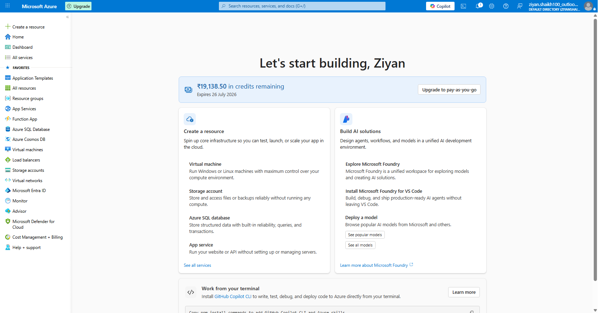

# \# Lab 01: BASICS OF ENTRA ID AND AZURE CLOUD ENVIRONMENT

### 1\. Objective

##### 

##### \- Create an Azure account.

##### \- Explore Entra ID 

##### \- Create users \& groups 

##### \- Assign roles to those users, remove assignments.

##### \- Invite an External User

##### \- Delete users and groups and Restore them.

### 2\. Tools \& Services Used

##### \- Azure Portal

##### \- Microsoft Entra ID

##### \- Gmail (External User)

### 3\. Steps Performed

##### &#x20;	

##### &#x20;Step 1 - Created an Azure Account

###### This was the easiest part, I logged into portal.azure.com and created a free account. I also tried to get the developer sandbox but unfortunately it said that I am not eligible. 

###### 

###### I filled it my details, clicked on create and Voila! 

###### 

###### My first Azure account was ready, it also gave me USD 200 in credits to spend on Azure!

###### 

##### &#x20;

##### &#x20;Step 2 - Explored Azure Environment

###### Explored Azure functions and applications like Entra ID, App services, Azure Cosmos. Its impressive to be able to do so much virtually without having the physical machines lying somewhere in your office building. 

###### 

###### But as someone rightly said "There's no such thing as a cloud, its just someone else's machine". 

###### 

###### In the coming days, I will explore even more of the features that come with my Azure membership, create virtual machines and use them as resources to be assigned to users and groups on Entra.

###### !\[Screenshot Step 2](../Screenshots/lab01-step2.png)

##### &#x20;

##### &#x20;Step 3 — Entra ID setup and User assignment

###### Explored the tenant ID given to me. My domain is actually the email I used to sign up for Azure. I guess I might be able to change it later or not, we'll find out. 

###### 

###### I could only see one user which was my own ID. I was automatically assigned the role of a Global Administrator which can do almost all changes to the tenant ID. 

###### 

###### I needed more users so i added 3 more users and assigned them roles like Global Admin, Office Apps Administrator and Knowledge Manager.

###### 

###### !\[Screenshot Step 3](../Screenshots/lab01-step3.png)

##### &#x20;

##### &#x20;Step 4 — Added Groups, explored group types and Membership types

###### I found out there are 2 types of groups that we can create on Entra - Security Group and M365 groups. I'll talk about my Learnings on both of them in the notes section of my repository.

###### 

###### Then, I learnt about the membership types - Assigned membership and Dynamic Membership. 

###### 

###### Dynamic membership group was not possible to be made because it requires P2 license and I dont have it yet.

###### 

###### I created a Security group and a M365 group with assigned members. 

###### 

###### I assigned admin level or management level users Inside the security group and the rest in the M65 Group.

##### &#x20;

##### &#x20;Step 5 — Deleted Groups and users, restored them and understood restoration conditions

###### After creating these two groups meticulously, I was hesitant to delete them but it was necessary to explore the restoration options as part of my Learning.

###### 

###### Restoration of groups and users come with a timeline of 30 days, after which all the details of that entity will be lost. 

###### 

###### Its good to know that in real production environments, the massive amount of data linked to each entity is covered by this restoration Policy.

##### &#x20;

##### &#x20;Step 6 — Invited an External User

###### I needed to see how would the creation type change and so I invited an external user which was my own demo account on Gmail. I then explored what roles and permissions can be given to this external user 

###### 

###### Inside my tenant environment. After successful acceptation of the invite, I could see the Creation type for this user listed as 'Invitation'.

###### 

###### This guest user was Added to my Entra tenant for the sole purpose of audit. 

###### 

###### Hence, I was able to simulate what it would look like when B2B relationships require inviting an external auditor to audit their own security measures.

### 4\. Key Learnings

###### \- When creating a group, you can select the group type, once created, you can not change this parameter. 

###### 

###### \- Dynamic groups are either a security group or M365 and their members are added or removed by pre-set Rules.

###### 

###### \- You can securely share your companies resources with external users by inviting them as guests; all while maintaining control over your own corporate data.

### 5\. Issues Faced \& How I Solved Them (Optional but impressive)

###### \- **Issue**: Not being able to add Dynamic membership to a group.

###### \- **Solution**: This is a P2 licencse functionality and hence I had to purchase a trial of this license in order to do so and explore the API queries of Dynamic user and device parameters.

###### 

###### \- **Issue**: Could not see groups that I was Added to as an external user. 

###### \- **Solution**: Hard refreshed the page, made sure that I was assigned the right tenant member group.

### 6\. References

###### \- Microsoft Identity and Access Administrator Youtube Course https://www.youtube.com/playlist?list=PLahhVEj9XNTf6lWUbZLBNULQ7uVqM5Sad

###### \- Microsoft learn articles

