# **Lab 03: Managing User Roles in Microsoft Entra ID**

---

##  Objective

To manage user roles, licenses, and application permissions in Microsoft Entra ID using both the **portal** and **Microsoft Graph PowerShell**, based on the Microsoft Learn lab *“Manage User Roles”* with custom adaptations.

---

##  Tools & Services Used

- Microsoft Entra Admin Center  
- Microsoft 365 Admin Center  
- Microsoft Graph PowerShell module  
- CSV-based bulk user import  

---

##  Steps Performed

---

### **Step 1 — Created a New Entra ID Tenant and Initial User**

I started by creating a new Microsoft Entra ID tenant and adding an initial user.  
This established the environment needed to test role assignments, licenses, and app permissions.

[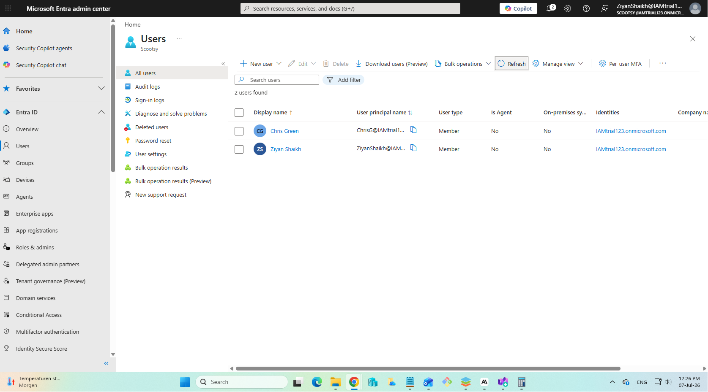](Screenshots/Created-a-new-entraandaddeduser.png)

---

### **Step 2 — Logged In as Chris Green (Without Admin Roles)**

Next, I logged in as **Chris Green**, a standard user with no administrative roles assigned.  
This helped me understand the default capabilities of a non-privileged user in Entra ID.

[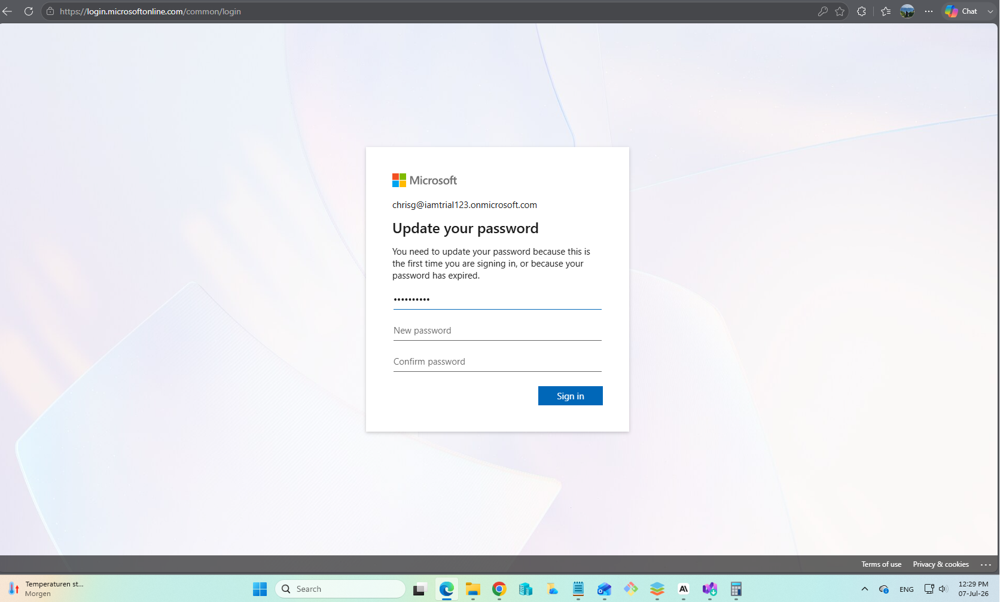](Screenshots/LoggedIn-as-Chris-Green.png)

---

### **Step 3 — Verified Chris Cannot Create Applications**

While logged in as Chris, I attempted to create an application in the Entra App Gallery.  
The portal showed that Chris did **not** have permission to create apps, confirming the lack of appropriate roles.

[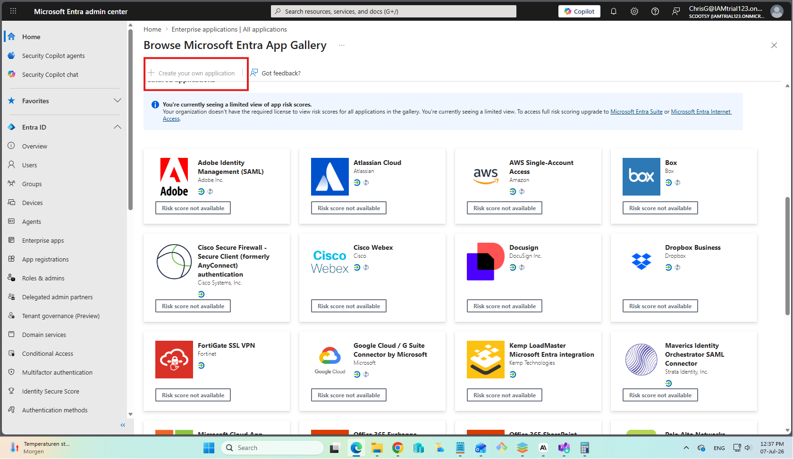](Screenshots/No-Permission-to-createApps.png)

---

### **Step 4 — Assigned Application Administrator Role to Chris**

Using the Entra Admin Center, I assigned the **Application Administrator** role to Chris.  
This role allows users to create and manage app registrations and enterprise applications.

[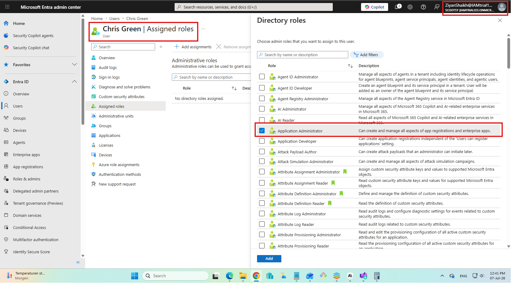](Screenshots/Assigned-App-admin-to-Chris.png)

---

### **Step 5 — Chris Gains Permission to Create Own Apps**

After the role assignment, Chris now had the ability to create his own applications in the App Gallery.  
This demonstrates how role changes immediately affect user capabilities.

[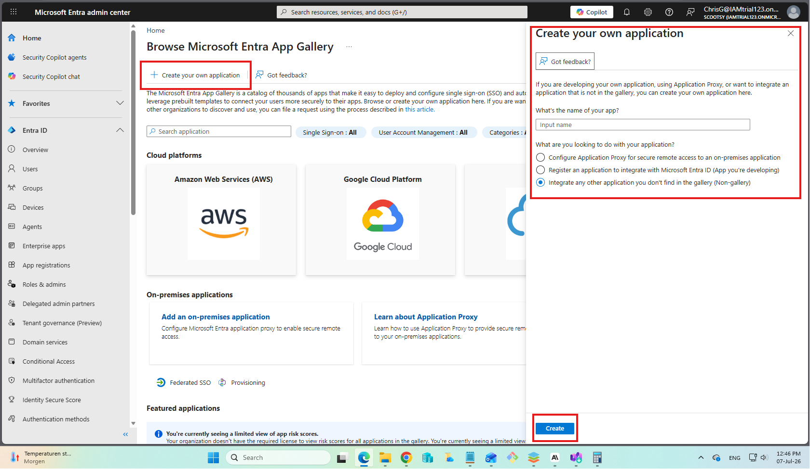](Screenshots/Chris-gets-create-own-app-access.png)

---

### **Step 6 — Performed Bulk Import of Users**

I then performed a **bulk import of users** using the Microsoft 365 Admin Center.  
This is a common IAM scenario for onboarding multiple users efficiently.

[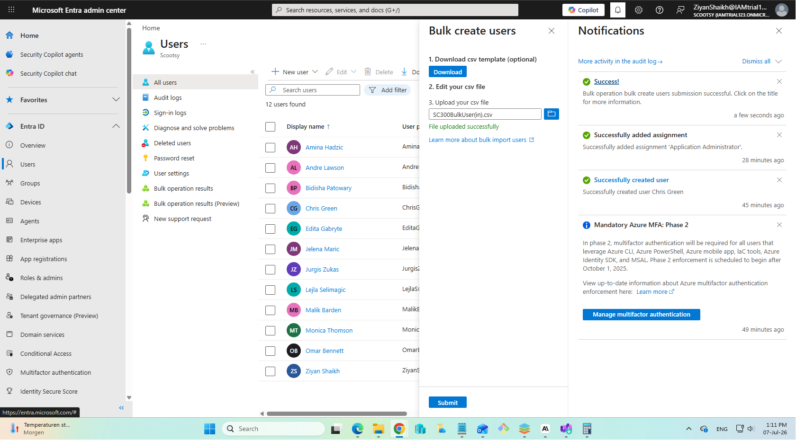](Screenshots/Bulk-import-of-users.png)

---

### **Step 7 — Reviewed CSV File Containing User Data**

To support the bulk import, I used a CSV file containing user details such as display name, username, and password settings.  
Reviewing the CSV ensured that the data structure matched the required format for successful import.

[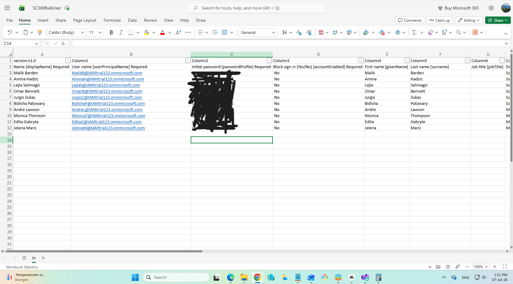](Screenshots/CSV-File-Containing-user-data.png)

---

### **Step 8 — Installed Microsoft Graph PowerShell Module**

To automate identity tasks, I installed the **Microsoft Graph PowerShell module**.  
This module is the modern way to interact with Entra ID programmatically and replaces older AzureAD cmdlets.

[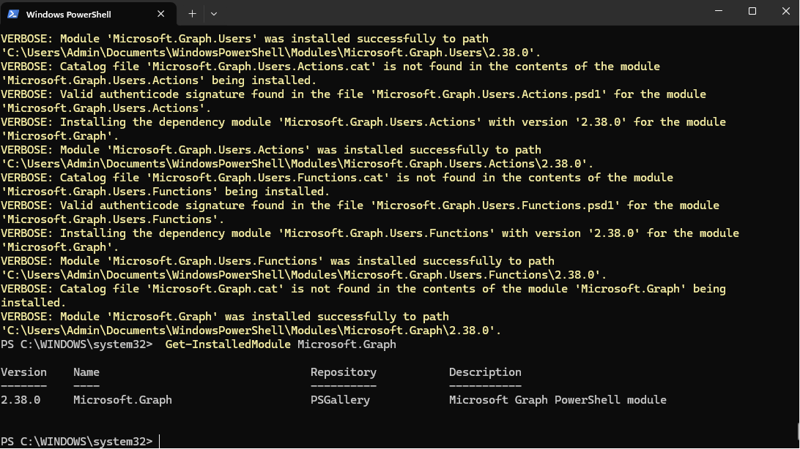](Screenshots/Installed-Powershell-Graph-Module.png)

---

### **Step 9 — Created a New User Using Microsoft Graph**

Using the `New-MgUser` cmdlet, I created a new user via PowerShell.  
I resolved initial domain-related issues by using the correct verified domain, demonstrating practical troubleshooting.

[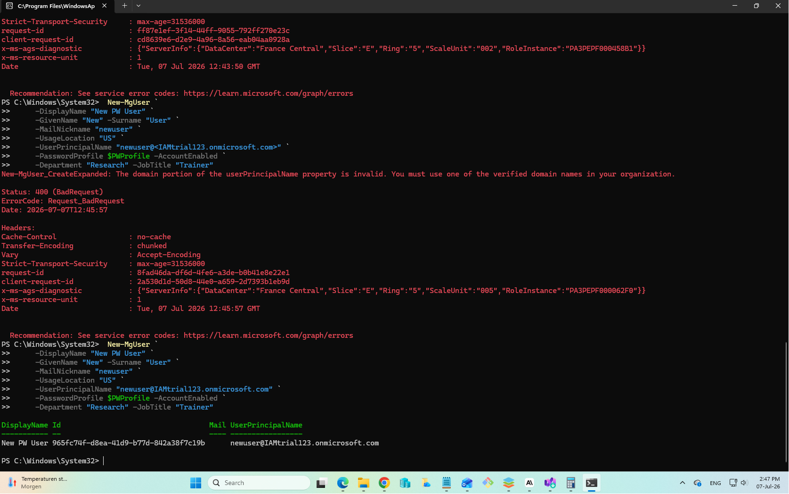](Screenshots/Added-a-new-user-using-Microsoft-Graph.png)

---

### **Step 10 — Verified New User in the Entra Admin Center GUI**

After creating the user with PowerShell, I confirmed that the new account appeared in the Entra Admin Center.  
This validated that the PowerShell operation successfully synchronized with the portal.

[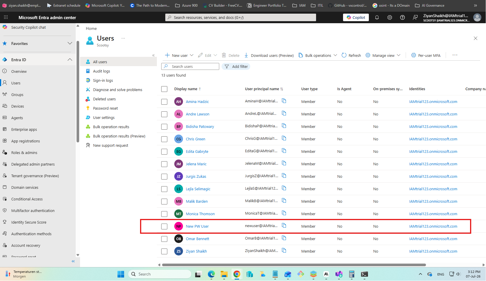](Screenshots/New-user-reflects-in-the-GUI.png)

---

### **Step 11 — Assigned P2 License to Monica Thomson**

In the Microsoft Learn lab, the suggested license was Windows 10/11 Enterprise.  
In my environment, I instead assigned the **Microsoft Entra ID P2 license** to **Monica Thomson** using the Microsoft 365 Admin Center, aligning the exercise with my available licenses.

[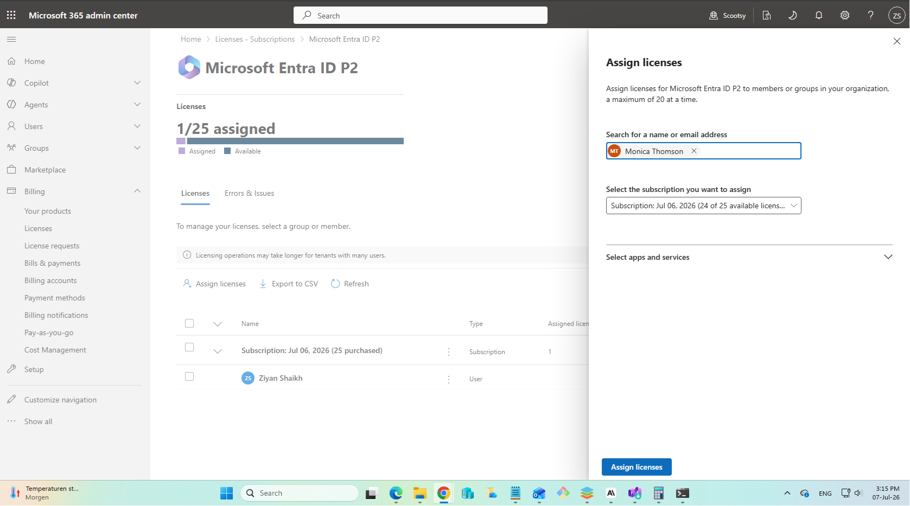](Screenshots/Assigned-p2-license-to-Monica-Thomson.png)

---

##  Key Learnings

- Role assignments (like Application Administrator) directly control what users can do with apps in Entra ID.  
- Bulk user import via CSV is essential for scalable onboarding in real environments.  
- Microsoft Graph PowerShell enables repeatable, automated identity operations and requires careful domain configuration.  
- License assignment must be adapted to the licenses available in the tenant (e.g., using Entra ID P2 instead of Windows Enterprise).  

---

##  Lab Outcome

Successfully completed user role management, bulk user onboarding, PowerShell-based user creation, and license assignment in Microsoft Entra ID.  
This lab closely follows the **SC-300 Manage User Roles** module while reflecting realistic tenant constraints and administrative workflows.

---

##  Screenshots Summary

| #  | Description                                   | Screenshot                                                         |
|----|-----------------------------------------------|--------------------------------------------------------------------|
| 1  | Created new Entra tenant and initial user     | [View](Screenshots/Created-a-new-entraandaddeduser.png)           |
| 2  | Logged in as Chris Green                      | [View](Screenshots/LoggedIn-as-Chris-Green.png)                    |
| 3  | Chris has no permission to create apps        | [View](Screenshots/No-Permission-to-createApps.png)                |
| 4  | Assigned Application Administrator to Chris   | [View](Screenshots/Assigned-App-admin-to-Chris.png)                |
| 5  | Chris gains create-own-app access             | [View](Screenshots/Chris-gets-create-own-app-access.png)           |
| 6  | Bulk import of users                          | [View](Screenshots/Bulk-import-of-users.png)                       |
| 7  | CSV file containing user data                 | [View](Screenshots/CSV-File-Containing-user-data.png)              |
| 8  | Installed Microsoft Graph PowerShell module   | [View](Screenshots/Installed-Powershell-Graph-Module.png)         |
| 9  | Created user using Microsoft Graph            | [View](Screenshots/Added-a-new-user-using-Microsoft-Graph.png)    |
| 10 | New user visible in Entra Admin Center        | [View](Screenshots/New-user-reflects-in-the-GUI.png)               |
| 11 | Assigned Entra ID P2 license to Monica        | [View](Screenshots/Assigned-p2-license-to-Monica-Thomson.png)     |

---
